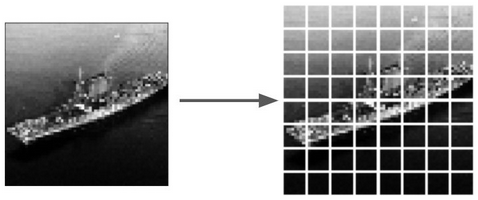

# Assignment 1: Color Spaces and Data Augmentation

Image transformations are fundamental to computer vision. They have a range of uses from introducing new perspectives of the image to data augmentation. This assignment explores conversions between common color spaces and a few transformations. These transformations are used in data augmentation techniques as a pre-processing step for the machine learning methods we will explore later in the semester.

## Color Spaces

The first part of the assignment focuses on two common color spaces: RGB (red-green-blue) and HSV (hue-saturation-value).

### RGB to HSV

Create a function that converts an RGB image represented as a `numpy` array into HSV format. The general process for this is covered in the [lecture notes](https://ajdillhoff.github.io/notes/color/).

### HSV to RGB

We will also need a function to revert the conversion. Create a function that converts an HSV image represented as a `numpy` array into RGB format.
The process for this is also covered in the [lecture notes](https://ajdillhoff.github.io/notes/color/).

### Optimization

The conversion functions you wrote above are likely slow. This is because they are implemented using `for` loops. This is not ideal for Python. Instead, we can use `numpy` to vectorize the operations. This will allow us to perform the operations on the entire image at once. This is much faster than looping over each pixel.

Ensure that both of your functions are implemented without using `for` loops to scan over the image. You can use `numpy` to vectorize the operations.

### Testing

To verify that your solution works, create a program that accepts the following input from command line:

- a filename
- Hue value modification value
- Saturation modification
- Value modification

The hue input should be clamped to $[0^{\circ}, 360^{\circ}]$. Saturation and value inputs should be within range $[0, 1]$. If they are not, warn the user an exit the program. Assuming all inputs are accepted, load and modify the image using the functions you wrote above and save the modified image to a new file.

Save your code as `color_space_test.py`.

## Image Transformations

Save all of the functions below in a file named `img_transforms.py`.

1. Create a function that will generate a random square crop of an image given the following inputs:
- An image as a `numpy` array.
- An integer reflecting the size.

The function should check to make sure the crop size is feasible given the input image size. For example, if the image size is $w \times h$, then the input size $s$ must be in range $s \in (0, \text{min}(w, h)]$. Your function should pick a random center location from which to crop and then return the cropped image.

The function should be implemented as `random_crop(img, size)`.

Figure 1: Original image on right followed by several crops. Source: torchvision

2. Patch extraction is a useful preprocessing step in machine learning. Following the instructions [given here](https://twitter.com/MishaLaskin/status/1478500251376009220), create a function that returns $n^2$ non-overlapping patches given an input image as a `numpy` array and an integer `n`.

You may assume that the input image is square. The function should be implemented as `extract_patch(img, num_patches)`.

Figure 2: Image patches extracted from original image (left).

3. Create a resizing function that resizes an image given an input image as a `numpy` array and an integer representing the desired scale factor. The image should be resized using nearest neighbor interpolation.

The function should be implemented as `resize_img(img, factor)`.

Figure 3: Image resized with different scale factors. Source: torchvision

4. Create a function which randomly perturbs the HSV values on an input image by an amount no greater than the given input value. This should use your code from the first part of the assignment to modify the HSV channels.

The function should be implemented as `color_jitter(img, hue, saturation, value)`.

Figure 4: Image randomly perturbed with random HSV changes. Source: torchvision

## Image Pyramids

Create a function that takes an image as a `numpy` array as well as an integer representing the height of the image pyramid. The function should create an image pyramid of resized copies of the original image based on the input integer. You should use your own version of a resize function from the first section.

For example, if the pyramid height is 4 and the input image is $256 \times 256$, your program should create 3 resized copies in powers of 2. That is, it will create a $128 \times 128$, $64 \times 64$, and $32 \times 32$ version. Your program should save the resized copies with the same name as the original file with the scale factor appended at the end. For example, if the input file name is `img.png`, the created images would be `img_2x.png`, `img_4x.png`, and `img_8x.png`.

Save your code as `create_img_pyramid.py`.