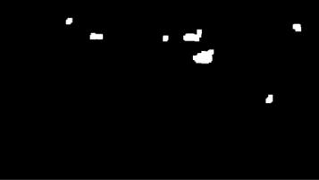

This assignment covers multiple object detection and tracking with Kalman filters.

An `environment.yml` file has been included for easier setup. To create the environment, run the following command:
```bash
conda env create -f environment.yml
```

# Detecting Motion

To be able to track a moving object, it needs to be in motion. Using Kalman filters, our object detector does not need to be robust. This detector will be based off of the motion between frames. If only two frames are considered, it may be possible that the "motion" was really just noise.

Instead, two differences are evaluated: one between the frames at $t$ and $t − 1$ as well as the difference between frames $t − 1$ and $t − 2$. The detected motion frame will be the minimum of these two. An easy way to filter out noise is to set a threshold $\tau$ . This will serve as a hyperparameter of the detector. If the pixel values in the motion frame are less than $\tau$, they are set to 0.

<figure>
  
  <figcaption>Figure 1: Detected pixels of the threshold frame.</figcaption>
</figure>

As seen above, the resulting pixels do not represent a whole object. Ideally, the detected blobs of motion would be fully connected. It is simple enough to modify the image by performing dilation on the pixels. This can be done via `scikit-image` using the `dilation` function. The figure below shows the resulting image after dilating each pixel using a $9 \times 9$ window.

<figure>
  
  <figcaption>Figure 2: The motion blobs after dilation.</figcaption>
</figure>

The resulting blobs are now individual object candidates. To track these individually, assign a class value to each pixel belonging to the same blob. This can be accomplished using a connected components algorithm similar to the approach used when connected low and high confidence edges in Canny edge detection. Conveniently, `scikit-image` implements this with the `label` function. An example of its usage can be found [here](https://scikit-image.org/docs/dev/auto_examples/segmentation/plot_regionprops.html).

In this example, `regionprops` is used to compute the centroid and bounding box of each blob. These properties can be used to filter out blobs that do not meet a size threshold. **Figure 3** shows the resulting candidates with their bounding boxes.

<figure>
  
  <figcaption>Figure 3: Bounding boxes draw on object candidates.</figcaption>
</figure>

## `MotionDetector` Class

Create a motion detection class that maintains a list of object candidates detected over time. This class should include a function that updates the tracking given a new frame.

Since at least 3 frames are needed for initialization, the first 3 frames of a video can be used as part of the initialization. This class should include the following hyperparameters:
- $\alpha$ - Frame hysteresis for determining active or inactive objects.
- $\tau$ - The motion threshold for filtering out noise.
- $\delta$ - A distance threshold to determine if an object candidate belongs to an object currently being tracked.
- $s$ - The number of frames to skip between detections. The tracker will still work well even if it is not updated every frame.
- $N$ - The maximum number of objects to track.

The list of objects that are currently maintained in this class will each be represented by a Kalman filter. That is, there will be a set of state parameters for each object.

# Kalman Filters

The objects themselves will be tracked using Kalman filters. The motion detector supplies a list of candidates for which each object currently tracked can be compared. The logic behind this system is as follows:
- If an object proposal is active over $\alpha$ frames, it should be added to the list of currently tracked objects.
- If the distance between an object proposal and the prediction of one of the filters is less than $\delta$, assume that proposal is a measurement for the corresponding filter.
- If a currently tracked object has not been updated with a measurement in $\alpha$ frames, consider it to be inactive and remove the filter from the current list of tracked objects

## `KalmanFilter` Class

Create a class which implements a basic Kalman filter. Along with initialization, the class should implement a `predict()` and `update(y)` function. These functions should follow the prediction and update equations for Kalman filters.

Establish a set of filter parameters following [this article](https://ajdillhoff.github.io/notes/tracking/). Each motion object will have its own instance of this class to track the current state. Additionally, keep a list of the object’s previous positions for visualization purposes.

# Tracking Multiple Objects

Create a GUI program that loads a video given a filename from command line. A GUI demo using `pyside6` is included in this repository. Feel free to use that as a starting point to integrate your object tracker into. You can view the documentation for `pyside6` [here](https://doc.qt.io/qtforpython-6/)

Once the video is loaded, initialize your object tracker and update it as the user changes the frame. This is where keeping a history of tracking objects will be useful. If the user slides back to a frame already visited, the model should re-initialize at that frame. Add a few buttons to the UI to allow the user to jump forward and backward by 60 frames instead of 1 frame.

When drawing the tracked objects, show a trail of detections behind each object as it is tracked.
